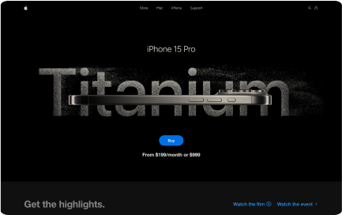

<div align="center">
  <br />
      
  <br />
  <br />
  <br />

  <div>
    
    
    
    
  </div>

  <h3 align="center">iPhone 15 Promotion Site</h3>

</div>

## <a name="tech-stack">⚙️ Tech Stack</a>

- React.js
- Three.js
- React Three Fiber
- React Three Drei
- GSAP 
- Vite
- Tailwind CSS

## <a name="quick-start">🚀 Quick Start</a>

Follow these steps to set up the project locally on your machine.

**Prerequisites**

Make sure you have the following installed on your machine:

- [Git](https://git-scm.com/)
- [Node.js](https://nodejs.org/en)
- [npm](https://www.npmjs.com/) (Node Package Manager)

**Cloning the Repository**

```bash
git clone https://github.com/thatoramphore/iphone-site
cd iphone-site
```

**Installation**

Install the project dependencies using npm:

```bash
npm install
```

**Running the Project**

```bash
npm run dev
```

Open [http://localhost:5173](http://localhost:5173) in your browser to view the project.